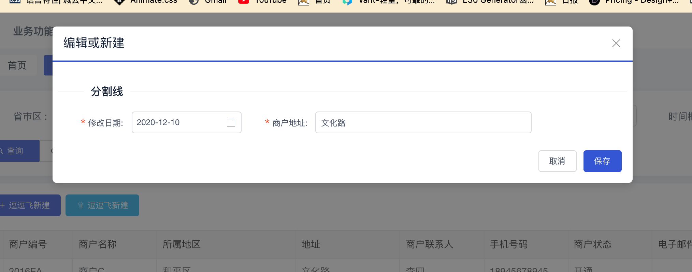

# beansflight-json-form

# 一份配置，轻松搞定配置 Vue 表单渲染

---

**表单可以说是前端开发中最经常遇到的元素之一。在日常表单的开发中，存在着 `v-if` 条件渲染、满屏 `magic number` 枚举值，再加上表单之间的复杂的联动交互的情况，往往使得一个看似简单的表单变得愈加臃肿不堪。**

**表单的联动关系与状态重置往往散落在各个函数方法中，随着需求的不断扩充与变更，使得表单之间的耦合复杂度上升，对于后续的开发者而言，很难清晰快速地了解表单中隐含的业务逻辑与联动关系，这使得表单变得非常不便于维护。**

**beansflight-vue-json-form 具有数据收集、校验和提交功能的表单生成器，支持双向数据绑定和事件扩展，组件包含有复选框、单选框、输入框、下拉选择框等表单元素以及省市区三级联动,时间选择,日期选择,颜色选择,滑块,评分,框架,树型,文件/图片上传等功能组件**

# 一· JSONForm 组件目前支持的类型(config 中的 type 属性)

1. **Input：输入框**

   | 属性        | 说明                                                                                                                                                         | 类型    | 默认值 |
   | ----------- | ------------------------------------------------------------------------------------------------------------------------------------------------------------ | ------- | ------ |
   | extendType  | 输入框类型，可选值为 `text`、`password`、`textarea`、`url`、`email`、`date`、`number`、`tel`, 通过设置属性 `type` 为 `textarea` 来使用文本域，用于多行输入。 | String  | text   |
   | placeholder | 通过设置属性 `rows` 控制文本域默认显示的行数。占位文本                                                                                                       | String  | -      |
   | disabled    | 设置输入框为禁用状态                                                                                                                                         | Boolean | false  |

2. Select: 下拉框

   | 属性        | 说明           | 类型    | 默认值 |
   | ----------- | -------------- | ------- | ------ |
   | multiple    | 是否支持多选   | Boolean | false  |
   | disabled    | 是否禁用       | Boolean | false  |
   | placeholder | 选择框默认文字 | String  | 请选择 |

3. DatePicker: 日期选择器

   | 属性         | 说明                                                                                 | 类型     | 默认值 |
   | ------------ | ------------------------------------------------------------------------------------ | -------- | ------ |
   | extendType   | 显示类型，可选值为 `date`、`daterange`、`datetime`、`datetimerange`、`year`、`month` | String   | date   |
   | placeholder  | 占位文本                                                                             | String   | 空     |
   | disabledDate | 设置不可选择的日期，参数为当前的日期，需要返回 Boolean 是否禁用这天                  | Function | date   |
   | disabled     | 是否禁用选择器                                                                       | Boolean  | false  |

4. Cascader: 级联组件

   | 属性        | 说明                                          | 类型    | 默认值 |
   | ----------- | --------------------------------------------- | ------- | ------ |
   | disabled    | 是否禁用选择器                                | Boolean | False  |
   | placeholder | 输入框占位符                                  | String  | 请选择 |
   | trigger     | 次级菜单展开方式，可选值为 `click` 或 `hover` | String  | hover  |

5. Checkbox: 多选框

   | 属性     | 说明                                                                | 类型                     | 默认值  |
   | -------- | ------------------------------------------------------------------- | ------------------------ | ------- |
   | disabled | 是否禁用当前项                                                      | Boolean                  | false   |
   | label    | 只在组合使用时有效。指定当前选项的 value 值，组合会自动判断是否选中 | String\| Number\|Boolean | Boolean |

6. Radio: 单选框

   | 属性     | 说明                                                                | 类型                     | 默认值  |
   | -------- | ------------------------------------------------------------------- | ------------------------ | ------- |
   | disabled | 是否禁用当前项                                                      | Boolean                  | false   |
   | border   | 是否显示边框                                                        | Boolean                  | False   |
   | label    | 只在组合使用时有效。指定当前选项的 value 值，组合会自动判断是否选中 | String\| Number\|Boolean | Boolean |

7. Switch: switch 滑块

   | 属性     | 说明     | 类型    | 默认值 |
   | -------- | -------- | ------- | ------ |
   | disabled | 禁用开关 | Boolean | false  |

# 二·安装依赖与配置

## 依赖安装

```shell
yarn add beansflight-json-form
```

## 在 main.js 配置引入如下配置

```javascript
//main.js
....
import beansflightForm from 'beansflight-json-form';
import 'beansflight-json-form/beansflightJsonForm/beansflight-json-form.css';
Vue.use(beansflightForm);
....

```

# 三·表单类型

## 1 tablePanel - 列表

### 页面展示


### **使用方式**

```vue
<table-panel
      border
      ref="mainTable"
      :panelConfig="panelConfig"
      @newAction="newAction"
      @batchDeleteAction="batchDeleteAction"
      @allExportAction="allExportAction"
      @allExportAction="allExportAction"
      :columns="mainTable.columnArray"
      :value="mainTable.data"
      :loading="mainTable.loading"
      :pageNumber="queryForm.pageNum"
      :pageSize="queryForm.pageSize"
			:pageShow="true"
      :pageTotal="mainTablePage.total"
      @onChangePageNum="changeMainTablePagePageNum"
      @onChangePageSize="changeMainTablePagePageSize"
      @on-row-click="onRowClick"
>
  </table-panel>
```

#### **Table-panel 属性**

| 属性              | 必填项 | 类型            | 描述                         | 默认值 |
| ----------------- | ------ | --------------- | ---------------------------- | ------ |
| panelConfig       | true   | Object          | 用于配置列表项顶部安装       | -      |
| newAction         | False  | Function        | 新建按钮回调函数             | -      |
| batchDeleteAction | false  | Function        | 批量删除按钮回调函数         | -      |
| allExportAction   | false  | Function        | 导出全部按钮回调函数         | -      |
| batchExportAction | false  | Function        | 批量导出按钮回调函数         | -      |
| columns           | true   | Array           | 表格列的配置描述             |        |
| value             | true   | Array           | 表格数据                     |        |
| loading           | true   | Boolean         |                              |        |
| pageNumber        | true   | String          | 每页返回的数据条数           |        |
| pageSize          | true   | String          | 页码                         |        |
| pageShow          | false  | Boolean         | 是否显示翻页                 | true   |
| pageTotal         | true   | String          | 总页数                       |        |
| onChangePageNum   | true   | Function        | 切换每页数据条数时的回调函数 |        |
| onChangePageSize  | true   | Function        | 切换页码时回调函数           |        |
| onRowClick        | false  | (row,index)=>{} | 单击某一行时触发             |        |

#### **panelConfig**

| 属性    | 必填项 | 描述                                                    | 类型    | 默认值 | 备注 |
| ------- | ------ | ------------------------------------------------------- | ------- | ------ | ---- |
| show    | true   | 是否显示顶部默认 新建、批量删除、导出全部、批量导出按钮 | Boolean | true   |      |
| options | true   | 如果需要自定列表顶部操作按钮，则需要配置此项            | Array   | {}     |      |

##### **panelConfig.options**

| 属性      | 必填项 | 描述         | 类型     | 默认值  | 备注       |
| --------- | ------ | ------------ | -------- | ------- | ---------- |
| title     | true   | 按钮标题     | String   | Null    |            |
| type      | true   | 按钮主题     | String   | primary | 有四种主题 |
| icon      | true   | 按钮图标     | String   | Null    |            |
| privilege | true   | 按钮权限     | String   | Null    |            |
| click     | true   | 按钮回调函数 | Function | Null    |            |

```javascript
      panelConfig: {
        show: false, // 是否显示顶部默认 新建、批量删除、导出全部、批量导出按钮
        options: [
          {
            title: '逗逗飞新建', // 按钮标题
            type: 'primary', // 按钮主题
            icon: 'md-add', // 按钮图标
            privilege: 'merchant-info-list-add', // 按钮权限
            click: () => {
            },
          },
          {
            title: '逗逗飞新建', // 按钮标题
            type: 'info', // 按钮主题
            icon: 'ios-trash-outline', // 按钮图标
            privilege: 'merchant-info-list-add', // 按钮权限
            click: () => {
            },
          },
        ],
      },
```

#### **columns**

| 属性     | 必填项 | 描述                                                             | 类型   | 默认值 | 备注                                                                 |
| -------- | ------ | ---------------------------------------------------------------- | ------ | ------ | -------------------------------------------------------------------- |
| title    | true   | 列头显示文字                                                     | String | -      |                                                                      |
| key      | true   | 对应列内容的字段名                                               | String |        |                                                                      |
| minWidth | false  | 最小列宽                                                         | Number |        |                                                                      |
| type     | false  | 用于区分枚举转换/列表操作区 取值范围['switch','eunm', 'handler'] | String | -      | 如果需要处理枚举则 type: 'eunm'，如果是列表操作项则 type: 'handler', |
| enumKey  | false  | 枚举的 key                                                       |        |        | 对于项目中维护的枚举的 Key                                           |
| formate  | False  | 日期格式化                                                       | Sring  | -      | 格式参照 dayjs                                                       |
| align    | false  | 列表操作区位置固定                                               | String | -      | 如果是列表操作项则必传,固定值 align: 'right',                        |
| fixed    | false  | 列表操作区位置固定                                               | String | -      | 如果是列表操作项则必传,固定值 fixed: 'right',                        |
| options  | False  | 列表操作按钮                                                     | Array  | -      | 如果是列表操作项则必传,                                              |

```javascript
columnArray: [
  {
    title: '商户编号',
    key: 'code',
    minWidth: 100,
  },
  {
    title: '商户状态',
    key: 'status',
    minWidth: 120,
    type: 'eunm', // 用于枚举处理
    enumKey: 'STATUS',
  },
  {
    title: '电子邮件',
    key: 'email',
    minWidth: 140,
  },
  {
    title: "createDate",
    key: "createDate",
    formate: "YYYY-MM-DD",  用于日期格式化
    minWidth: 140,
  },
  {
    title: '操作',
    align: 'right',
    fixed: 'right',
    width: 150,
    type: 'handle',
    options: [
      {
        title: '查看',
        type: 'info',
        onClick: (row) => {
        },
      },
      {
        title: '编辑',
        directives: [
          {
            name: 'privilege',
            value: 'agency-info-list-update',
          },
        ],
        onClick: (row) => {
        },
      },
    ],
  },
],
```

##### **columons.options**

| 属性       | 必填项 | 描述         | 类型     | 默认值    | 备注                                                        |
| ---------- | ------ | ------------ | -------- | --------- | ----------------------------------------------------------- |
| title      | true   | 按钮标题     | String   | -         |                                                             |
| type       | false  | 按钮主题色   | String   | -         | type 取值范围:['info','success','primary','warning,'error'] |
| onClick    | true   | 按钮回调函数 | Function | (row)=>{} |                                                             |
| directives | false  | 按钮权限     | Array    | -         | {                                                           |

##### DEMO

```javascript
columnArray: [
  {
    title: '商户编号',
    key: 'code',
    minWidth: 100,
  },
  {
    title: '商户状态',
    key: 'status',
    minWidth: 120,
    type: 'eunm',
    enumKey: 'STATUS',
  },
  {
    title: '电子邮件',
    key: 'email',
    minWidth: 140,
  },
  {
    title: '操作',
    align: 'right',
    fixed: 'right',
    width: 150,
    type: 'handle',
    options: [
      {
        title: '查看',
        type: 'info',
        onClick: (row) => {
          this.$refs.merchantTableDetail.showModal(row);
        },
      },
      {
        title: '编辑',
        directives: [
          {
            name: 'privilege',
            value: 'agency-info-list-update',
          },
        ],
        onClick: (row) => {
        },
      },
    ],
  },
],
```

### 2  queryPanel - 查询

### 页面展示


### **使用方式**

```vue
<query-panel
  :config="formConfig"
  @query="query"
	@reset="reset"
>
  </query-panel>
```

#### **query-panel 属性**

| 属性   | 必填项 | 说明             | 类型     | 默认值       | 备注 |
| ------ | ------ | ---------------- | -------- | ------------ | ---- |
| config | true   | 查询项配置       | Object   | -            |      |
| query  | true   | 查询事件回调函数 | Function | (params)=>{} |      |
| reset  | false  | 重置按钮回调函数 | Fcuntion | ()=>{}       |      |

#### **config**

| 属性      | 必填项 | 说明           | 类型   | 默认值 | 备注                                                                                          |
| --------- | ------ | -------------- | ------ | ------ | --------------------------------------------------------------------------------------------- |
| formModel | true   | v-model 绑定项 | Object | -      | 框架目前支持 4 中交互 input：输入框、select：下拉列表、日历：dataPicker、Cascader：省市区级联 |
| formItems | true   | 布局项         | Array  |        | 用于绘制查询项表单                                                                            |

##### **config.formModel**

```javascript
formModel: {
          cascVal: [], // 级联
          selOptions: null, // 下拉框
          inputVal: null, // 输入框
          datePickerVal: null, // DatePicker
        },
```

##### **config.formItems**

| 属性        | 必填项 | 说明                                                         | 默认值 | 备注 |
| ----------- | ------ | ------------------------------------------------------------ | ------ | ---- |
| label       | true   | 输入框标题                                                   | -      |      |
| key         | true   | 绑定的值                                                     | -      |      |
| type        | true   | 组件类型  type 取值范围：[select、input、datePicker、 cascader] | -      |      |
| placeholder | true   | 占位文字                                                     | -      |      |
| span        | true   | 24栏布局 占比 如果不传则是6                                  | -      |      |
| control     | false  | 操作项                                                       | -      |      |


###### **config.formItems.control**

| 属性 | 必填项 | 说明         | 默认值      | 说明                         |
| ---- | ------ | ------------ | ----------- | ---------------------------- |
| on   | false  | 组件回调函数 | (Event)=>{} | 目前只实现了Select、cascader |

#### **DEMO**

```javascript
formItems: [
  {
    row: [
      {
        label: "省市区", // 标题
        key: "cascVal", //
        type: "cascader", // 组件类型 不区分大小写 级联多用于省市区选择  type 取值范围：[select、input、datePicker、 cascader]
        placeholder: "请选择城市/区县(可搜索）", // 占位文字
        span: 6, // 24栏布局 占比 如果不传则是6
        control: { // 操作项
          on:{
            change:()=>{ // 回调函数
              
            }
          }
        },
        options: [
          // 数据选项
          {
            value: "beijing",
            label: "北京",
            children: [
              {
                value: "gugong",
                label: "故宫",
              },
              {
                value: "tiantan",
                label: "天坛",
              },
              {
                value: "wangfujing",
                label: "王府井",
              },
            ],
          },
          {
            value: "jiangsu",
            label: "江苏",
            children: [
              {
                value: "nanjing",
                label: "南京",
                children: [
                  {
                    value: "fuzimiao",
                    label: "夫子庙",
                  },
                ],
              },
              {
                value: "suzhou",
                label: "苏州",
                children: [
                  {
                    value: "zhuozhengyuan",
                    label: "拙政园",
                  },
                  {
                    value: "shizilin",
                    label: "狮子林",
                  },
                ],
              },
            ],
          },
        ],
      },
      {
        label: "场地",
        key: "selOptions",
        type: "select",
        span: 6,
        options: [
          // 下拉框数据
          {
            label: "全部",
            value: "全部",
          },
          {
            label: "零食区",
            value: "零食区间",
          },
        ],
      },
      {
        label: "商户编号",
        key: "inputVal",
        placeholder: "占位符",
        type: "Input", // 输入框
        span: 6,
      },
      {
        label: "时间框",
        key: "datePickerVal",
        placeholder: "占位符",
        type: "datePicker", // 输入框
        // extendType: 'daterange', // date 单选  daterange 时间段
        span: 6,
      },
    ],
  },
]
```

## 3 editFormPanel -  编辑

### 页面展示



### 使用方式

```vue
<edit-form-panel
    title="编辑或新建"
    v-model="isShowDetailModal"
		displayed="model"
    :data="detail"
    :config="editConfig"
    @sumbit="sumbit"
    @cancel="cancel"
>
      <template v-slot:footer="data">
       	<div>底部按钮布局</div>
      	<div>{{ data }}</div>
     </template>

  </edit-form-panel>
```


#### **edit-form-panel 属性**

| 属性      | 必填项 | 说明                                               | 默认值        | 备注 |
| --------- | ------ | -------------------------------------------------- | ------------- | ---- |
| title     | true   | 标题                                               | -             |      |
| v-model   | true   | 控制弹窗是否显示                                   | False         |      |
| displayed | false  | 显示方式 支持 2 中显示方式 model:弹窗、panel: 平面 | model         |      |
| data      | true   | 表单项绑定对象                                     | -             |      |
| config    | true   | 表单配置项                                         | -             |      |
| footer    | false  | 页脚插槽                                           | slot          |      |
| sumbit    | true   | 确认按钮回调函数                                   | (params) =>{} |      |
| cancel    | true   | 取消按钮回调函数                                   | ()=>{}        |      |


#### **config**

| 属性      | 必填项 | 说明                            | 默认值 | 备注     |
| --------- | ------ | ------------------------------- | ------ | -------- |
| splitLine | false  | 是否显示分栏布局                | false  | 纵向分栏 |
| lineTitle | false  | 分栏标题                        | -      |          |
| row       | true   | 如果在一个行内布局，则用row嵌套 | -      |          |


##### **config.row**

| 属性        | 必填项 | 说明                                                         | 默认值 | 备注 |
| ----------- | ------ | ------------------------------------------------------------ | ------ | ---- |
| label       | true   | label标题                                                    | -      |      |
| type        | true   | 组件类型 不区分大小写 type取值范围['datePicker', 'input', 'select', 'cascader'] | -      |      |
| extendType  | false  | 组件扩展类型                                                 |        |      |
| key         | true   | 绑定的值                                                     | -      |      |
| placeholder | false  | 占位文字                                                     | -      |      |
| rule        | false  | 必填项验证                                                   | -      |      |
| props       | false  | 扩展属性                                                     |        |      |
| control     | false  | 输入项交互                                                   |        |      |


###### **config.row.control**

|     属性     | 必填项 | 说明               | 默认值          | 备注                                                         |
| :----------: | ------ | ------------------ | --------------- | ------------------------------------------------------------ |
|      on      | false  | 输入项交互回调函数 | {}              |                                                              |
| hiddenOption | false  | 输入项联动回调函数 | (formdata)=> {} |                                                              |
|  enumOption  | false  | 输入项枚举值转换   | -               | enumOption: {<br/>                  type: "STATUS",<br/>                }, |
| formatOption | false  | 输入项格式化       | -               | formatOption: {<br/>                  format: "YYYY-MM-DD",<br/>                }, |

#### **DEMO**

```javascript
      editConfig: [
        {
          splitLine: true, // 是否显示分栏布局 纵向分栏
          lineTitle: '分割线', // 分栏标题
          row: [ // 如果在一个行内布局，则用row嵌套
            {
              label: '修改日期', // label标题
              type: 'datePicker', // 组件类型 不区分大小写 type取值范围['datePicker', 'input', 'select', 'cascader']
              extendType: 'daterange', // 取值范围 [date 单选  daterange 时间段 ]
              key: 'modifyDate',  // 显示的字段名
              placeholder: '占位符', // 占位文字

              rule: [{ // 必填项验证
                type: 'date', required: true, message: '时间不能为空', trigger: 'blur',
              }],
               props: {
                // 扩展属性
                disabled: true, // 设置输入框为禁用状态
              },
              span: 8,
            },
            {
              label: '商户地址',
              type: 'input',
              key: 'address',
              extendType: "password", // 取值范围[text、password、textarea、url、email、date、number、tel]
              key: "name",
              props: {
                // 扩展属性
                disabled: true, // 设置输入框为禁用状态
              },
              rule: [{ required: true, message: '请输入地址', trigger: 'blur' }],
              span: 12,
            },
          ],
        },
      ],
```

## 4 detailFormPanel - 查看

### 页面展示


### **使用方式**

```vue
<detail-form-panel
  title="商户详情"
  v-model="isShowDetailModal"
  :data="detail"
  :config="detailConfig"
>
    <template v-slot:footer="data">
      <div>底部按钮布局</div>
      <div>{{ data }}</div>
    </template>
  </detail-form-panel>
```

#### **detail-form-panel 属性**

| 属性    | 必填项 | 说明           | 类型    | 默认值 | 备注 |
| ------- | ------ | -------------- | ------- | ------ | ---- |
| title   | true   | 标题           | String  | -      |      |
| v-model | true   | 页面显示隐藏   | Boolean | -      |      |
| footer  | false  | 页脚插槽       | Slot    | -      |      |
| data    | true   | 表单项绑定对象 | Object  | -      |      |
| config  | true   | 页面配置       | Object  | -      |      |


#### **config**

| 属性      | 必填项 | 说明                            | 类型  | 默认值   |
| --------- | ------ | ------------------------------- | ----- | -------- |
| splitLine | false  | 是否显示分栏布局                | false | 纵向分栏 |
| lineTitle | false  | 分栏标题                        | -     |          |
| row       | true   | 如果在一个行内布局，则用row嵌套 | -     |          |


##### **config.row**

| 属性        | 必填项 | 说明                                                         | 默认值 | 备注 |
| ----------- | ------ | ------------------------------------------------------------ | ------ | ---- |
| label       | true   | label标题                                                    | -      |      |
| type        | true   | 组件类型 不区分大小写 type取值范围['datePicker', 'input', 'select', 'cascader'] | -      |      |
| extendType  | false  | 组件扩展类型                                                 |        |      |
| key         | true   | 绑定的值                                                     | -      |      |
| placeholder | false  | 占位文字                                                     | -      |      |
| rule        | false  | 必填项验证                                                   | -      |      |
| props       | false  | 扩展属性                                                     |        |      |
| control     | false  | 输入项交互                                                   |        |      |


###### **config.row.control**

| 属性         | 必填项 | 说明               | 默认值          | 备注                                                         |
| ------------ | ------ | ------------------ | --------------- | ------------------------------------------------------------ |
| on           | false  | 输入项交互回调函数 | {}              |                                                              |
| hiddenOption | false  | 输入项联动回调函数 | (formdata)=> {} |                                                              |
| enumOption   | false  | 输入项枚举值转换   | -               | enumOption: {<br/>                  type: "STATUS",<br/>                }, |
| formatOption | false  | 输入项格式化       | -               | formatOption: {<br/>                  format: "YYYY-MM-DD",<br/>                }, |


#### **DEMO**

```javascript
config: [
  {
    row: [
      {
        label: '修改日期',
        type: 'datePicker',
        key: 'modifyDate',
        placeholder: '占位符',
        // rule: [{
        //   type: 'date', required: true, message: '时间不能为空', trigger: 'blur',
        // }],
        // extendType: 'daterange', // date 单选  daterange 时间段
        span: 24,
      },
    ],
  },
  {
    row: [
      {
        label: '商户地址',
        type: 'input',
        key: 'address',
        // rule: [{ required: true, message: '请输入地址', trigger: 'blur' }],
        extendType: '', // 扩展type
        span: 24,
      },
    ],
  },
],
```

## 5 newFormPanel - 新建

### 页面展示


### 使用方式

```vue
<NewFormPanel
  title="新建"
  v-model="isShowDetailModal"
  :data="newForm"
  :config="newConfig"
  @sumbit="sumbit"
  @cancel="cancel"
>
  </NewFormPanel>
```

#### **new-form-panel 属性**

| 属性    | 必填项 | 说明           | 类型    | 默认值 |
| ------- | ------ | -------------- | ------- | ------ |
| title   | true   | 标题           | String  | -      |
| v-model | true   | 页面显示隐藏   | Boolean | -      |
| footer  | false  | 页脚插槽       | Slot    | -      |
| data    | true   | 表单项绑定对象 | Object  | -      |
| config  | true   | 页面配置       | Object  | -      |


#### **config**

| 属性      | 必填项 | 说明                            | 类型  | 默认值   |
| --------- | ------ | ------------------------------- | ----- | -------- |
| splitLine | false  | 是否显示分栏布局                | false | 纵向分栏 |
| lineTitle | false  | 分栏标题                        | -     |          |
| row       | true   | 如果在一个行内布局，则用row嵌套 | -     |          |


##### **config.row**

| 属性        | 必填项 | 说明                                                         | 默认值 | 备注 |
| ----------- | ------ | ------------------------------------------------------------ | ------ | ---- |
| label       | true   | label标题                                                    | -      |      |
| type        | true   | 组件类型 不区分大小写 type取值范围['datePicker', 'input', 'select', 'cascader'] | -      |      |
| extendType  | false  | 组件扩展类型                                                 |        |      |
| key         | true   | 绑定的值                                                     | -      |      |
| placeholder | false  | 占位文字                                                     | -      |      |
| rule        | false  | 必填项验证                                                   | -      |      |
| props       | false  | 扩展属性                                                     |        |      |
| control     | false  | 输入项交互                                                   |        |      |


###### **config.row.control**

| 属性         | 必填项 | 说明               | 默认值          | 备注                                                         |
| ------------ | ------ | ------------------ | --------------- | ------------------------------------------------------------ |
| on           | false  | 输入项交互回调函数 | {}              |                                                              |
| hiddenOption | false  | 输入项联动回调函数 | (formdata)=> {} |                                                              |
| enumOption   | false  | 输入项枚举值转换   | -               | enumOption: {<br/>                  type: "STATUS",<br/>                }, |
| formatOption | false  | 输入项格式化       | -               | formatOption: {<br/>                  format: "YYYY-MM-DD",<br/>                }, |


#### **DEMO**

```javascript
      newConfig: [
        {
          row: [
            {
              label: "商户名称",
              type: "input",
              // extendType: "password", // 取值范围[text、password、textarea、url、email、date、number、tel]
              key: "name",
              props: {
                // 扩展属性
                // disabled: true, // 设置输入框为禁用状态
              },
              span: 8,
            },
            {
              label: "测试滑块",
              type: "switch",
              // extendType: "password", // 取值范围[text、password、textarea、url、email、date、number、tel]
              key: "switchKey",
              props: {
                // 扩展属性
                // disabled: true, // 设置输入框为禁用状态
              },
              span: 8,
            },
            {
              label: "商户统一定价",
              type: "select",
              key: "isUniformprice",
              options: [
                { value: "0", label: "否" },
                { value: "1", label: "是" },
              ],
              span: 8,
              control: { // 组件联动 Switch为选中时，显示此组件
                handle: (form) => {
                  return form.switchKey === true;
                },
              },
            },
            {
              label: "商户状态",
              type: "select",
              key: "status",
              props: {
                // disabled: true, //是否禁用
              },
              options: [
                { value: "0", label: "否" },
                { value: "1", label: "是" },
              ],
              span: 8,
              control: { // 组件联动
                handle: (form) => {
                  return form.switchKey === true;
                },
              },
            },
          ],
        },
      ],
```

## 6  formPanel - 展示

### 页面展示


### 使用方式

```vue
 <form-panel 
     :data="panelData" 
     :config="panelConfig"
 ></form-panel>
```

#### **form-panel 属性**

| 属性   | 必填项 | 说明           | 类型   | 默认值 | 备注 |
| ------ | ------ | -------------- | ------ | ------ | ---- |
| data   | true   | 表单项绑定对象 | Object | -      |      |
| config | true   | 页面配置       | Object | -      |      |


#### **config**

| 属性      | 必填项 | 说明                            | 类型  | 默认值   |
| --------- | ------ | ------------------------------- | ----- | -------- |
| splitLine | false  | 是否显示分栏布局                | false | 纵向分栏 |
| lineTitle | false  | 分栏标题                        | -     |          |
| row       | true   | 如果在一个行内布局，则用row嵌套 | -     |          |


##### **config.row**

| 属性        | 必填项 | 说明                                                         | 默认值 | 备注 |
| ----------- | ------ | ------------------------------------------------------------ | ------ | ---- |
| label       | true   | label标题                                                    | -      |      |
| type        | true   | 组件类型 不区分大小写 type取值范围['datePicker', 'input', 'select', 'cascader'] | -      |      |
| extendType  | false  | 组件扩展类型                                                 |        |      |
| key         | true   | 绑定的值                                                     | -      |      |
| placeholder | false  | 占位文字                                                     | -      |      |
| rule        | false  | 必填项验证                                                   | -      |      |
| props       | false  | 扩展属性                                                     |        |      |
| control     | false  | 输入项交互                                                   |        |      |


###### **config.row.control**

| 属性         | 必填项 | 说明               | 默认值          | 备注                                                         |
| ------------ | ------ | ------------------ | --------------- | ------------------------------------------------------------ |
| on           | false  | 输入项交互回调函数 | {}              |                                                              |
| hiddenOption | false  | 输入项联动回调函数 | (formdata)=> {} |                                                              |
| enumOption   | false  | 输入项枚举值转换   | -               | enumOption: {<br/>                  type: "STATUS",<br/>                }, |
| formatOption | false  | 输入项格式化       | -               | formatOption: {<br/>                  format: "YYYY-MM-DD",<br/>                }, |

#### **DEMO**

```javascript
    panelConfig: [
        {
          row: [
            {
              label: "商户名称",
              type: "input",
              extendType: "textarea", // 取值范围[text、password、textarea、url、email、date、number、tel]
              key: "name",
              props: {
                // 扩展属性
                disabled: true, // 设置输入框为禁用状态
                border: false, // 不显示边框
                bottom: 1,
              },
              control: {
                // 组件联动
                hiddenOption: (form) => {
                  return form.isUniformprice === "0"
                },
              },
              span: 8,
            },
            {
              label: "商户统一定价",
              type: "input",
              // type: "select",
              key: "isUniformprice",
              control: {
                // 组件enum
                enumOption: {
                  type: "STATUS",
                },
              },
              span: 8,
            },
            {
              label: "修改时间",
              type: "input",
              key: "modifyDate",
              control: {
                // 时间格式化
                formatOption: {
                  format: "YYYY-MM-DD",
                },
              },
              span: 8,
            },
          ],
        },
      ],
```


# 四·表单必填项验证

表单验证功能同样也是表单不可或缺的功能之一，JSONFom 通过 rule 节点来实现必填项验证

**rule 支持的验证数据类型**

| 属性    | 说明               |
| ------- | ------------------ |
| string  | 验证是否为字符串   |
| number  | 验证是否为 number  |
| boolean | 验证是否为 number  |
| method  | 验证是否为 method  |
| integer | 验证是否为 integer |
| float   | 验证是否为 float   |
| array   | 验证是否为 array   |
| object  | 验证是否为 object  |
| email   | 验证是否为 email   |

**rule**

| 属性     | 必填项 | 说明               | 类型    | 默认值 |
| -------- | ------ | ------------------ | ------- | ------ |
| type     | true   | 需要验证的数据格式 | String  | stirng |
| required | true   | 是否为必填项       | Boolean | -      |
| message  | true   | 必填项提示信息     | String  | -      |
| trigger  | true   | 验证触发方式       | String  | -      |


```javascript
formConfig: [
  ...
  	{
      row: [
        {
          	...
             rule: [
                {
                  type: "array",
                  required: true,
                  message: "支付渠道不能为空",
                  trigger: "blur",
                },
              ]
						...
        }
      ]
    }
  ...
]
```
